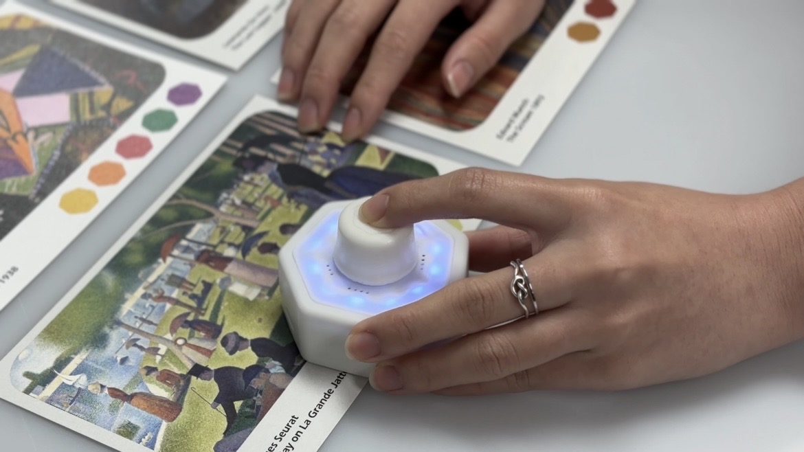
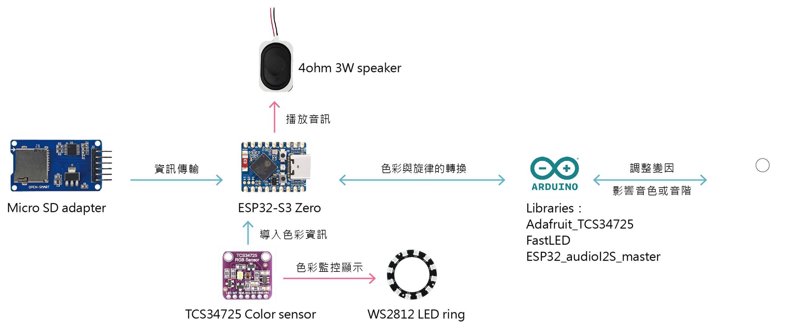

# Huemelody: An Interactive Device for Children Combining Colors and Music

  
  
<i>Huemelody — An interactive learning device that transforms colors into musical melodies</i>

## 🌈 Project Overview

Huemelody is a heptagonal interactive device that transforms colors into musical melodies, enhancing children's multi-sensory experience through color-to-music conversion. The device offers two interaction modes, allowing users to experience how colors from artworks, environments, and creative combinations can be converted into unique musical melodies using AI technology and color sensing.

  
  
<i>Figure 1: Interactive device Huemelody sensing artwork cards.</i>

Through hands-on interaction with Huemelody, users can explore the potential relationships between colors and sounds, fostering creativity, environmental awareness, and multi-sensory learning in children, providing enriching experiences in both individual and collaborative environments.

[Watch Huemelody in action demonstration video](https://www.youtube.com/watch?v=GMl0PmqDHKo)

## ✨ Features and Benefits

- **Accommodates Diverse Interaction Preferences**: Offers two interaction methods - observation of structured art cards and exploration of environmental colors
- **Multi-sensory Experience**: Simultaneously stimulates visual, auditory, and tactile senses, naturally enhancing focus and engagement
- **Self-directed Exploratory Learning**: Encourages children to discover connections between visual and auditory elements through firsthand exploration
- **Color-to-Music Mapping**: Creates musical melodies based on HSV color characteristics (hue, saturation, brightness)
- **Integration of Art and Technology**: Combines art appreciation with music creation, promoting STEAM education

  
  
  
<i>Figure 2, 3: The children were listening to the colors of music.</i>

## 🔧 Technical Implementation

Huemelody creates a seamless color-to-sound experience by combining sensing technology with algorithmic composition:

1. **Color Sensing**: Utilizes TCS34725 RGB color sensor to capture color data
2. **Data Processing**: Performs normalization, color space conversion, and classification
3. **Musical Mapping**: Maps colors to musical elements based on the HSV model
   - **Hue**: Determines instruments and scale modes
   - **Saturation**: Influences rhythmic complexity and note density
   - **Value (Brightness)**: Controls pitch range and melodic contour

  
  
<i>Figure 6: Interactive device internal process.</i>

### HSV Color Model to Music Mapping

The HSV color model generates music through three components:

**Hue** determines the instrument and mode:
- Red and Orange Hues (0°-60°): Strings/percussion, major modes, bright and majestic
- Yellow and Green Hues (60°-180°): Woodwinds, pentatonic scales, warm and smooth
- Blue and Purple Hues (180°-360°): Brass, minor modes, calm and melancholic

**Saturation** affects rhythmic complexity and note density:
- High Saturation: Dense notes, complex rhythms, fast-paced/jazz
- Low Saturation: Sparse notes, simple rhythms, lyrical/background music

**Value** impacts pitch range and melody contour:
- High Value (Bright): High pitch, ascending melodies, energetic/joyful
- Low Value (Dark): Low pitch, descending melodies, calm/mysterious

## 📐 Physical Design

Huemelody adopts a heptagonal structure, symbolizing Newton's theory of seven primary colors. The device dimensions (46mm height, 68mm diameter) are suitable for single-handed operation by children, with a color sensor located at the bottom.

  
  
  
<i>Figure 7, 8: The effects of an interactive device before and after sensing.</i>

  
  
<i>Figure 9: Sensor location of the device.</i>

## 🎨 Interaction Modes

Huemelody offers two primary interaction modes (toggled by long-pressing the top knob):

### 1. Basic Detection Mode

Displays and plays sounds for individual colors, and provides special sound effects for color families based on children's associations (e.g., alarm sounds for reds, dolphin sounds for blues). These special effects are triggered when five different colors from the same color family are consecutively detected.

  
  
  
<i>Figure 10, 11: Basic color scheme cards.</i>

### 2. Art Learning Mode

Collects five key colors from artwork and automatically plays the unique musical melody of that artwork, enhancing the art appreciation experience.

  
  
  
<i>Figure 12, 13: Artwork cards introduction in Mandarin.</i>

## 💡 Use Cases

Huemelody has been field-tested in different environments, creating engaging multi-sensory experiences:

- **Classroom Setting**: Children were fascinated by discovering what artworks "sound like," eagerly scanning Munch's paintings and competing to find the key colors that trigger the complete musical piece
- **Outdoor Setting**: The device transformed farm items into musical instruments, with children comparing the sounds of flowers, fruits, and natural materials

## 🔌 Hardware Configuration

- **Microcontroller**: ESP32 (supporting WiFi and Bluetooth connectivity)
- **Color Sensor**: TCS34725 RGB color sensor
- **LED Display**: 12 addressable RGB LEDs (WS2812B)
- **Audio Output**: I2S digital audio
- **User Input**: Rotary encoder (with button)
- **Storage**: MicroSD card (for storing audio files)

## 🛠️ Setup and Operation

### Required Hardware
- ESP32 development board
- TCS34725 RGB color sensor
- WS2812B RGB LED ring (12 LEDs)
- Rotary encoder (EC11 type)
- MAX98357A I2S audio amplifier
- MicroSD card module
- Small speaker
- Lithium battery and charging circuit

### Connection Diagram
Detailed wiring diagrams can be found in the `hardware` folder.

### Software Installation
1. Install Arduino IDE and ESP32 board support
2. Install required libraries:
   - Adafruit_TCS34725
   - FastLED
   - ESP32-audioI2S
   - SD
3. Upload `src/Huemelody.ino` to ESP32

### Operation Instructions
- **Short press button**: Start/stop color detection
- **Long press 3 seconds**: Switch operation modes
- **Long press 5 seconds**: Enter sleep mode
- **Rotate encoder**:
  - Rotate while pressing: Adjust volume
  - Rotate without pressing: Switch tracks in audio playback mode

## 🧩 Future Enhancement Plans

- **Hardware Upgrades**: Improve portability, durability, color detection accuracy, and battery life
- **Collaborative Mode**: Wireless communication between multiple devices, allowing group music creation
- **Custom Sound Mapping**: Simple interface for educators to create color-sound relationships targeting specific learning objectives
- **Accessibility Features**: Make Huemelody suitable for children of various abilities, including tactile feedback options and amplified sound settings

## 👥 Team Members

- **Jie-Yu Ching**
  - Department of Creative Technology and Product Design, National Taipei University of Business
  - joycejing1014@gmail.com

- **Shao-Cheng Chen**
  - Department of Creative Technology and Product Design, National Taipei University of Business
  - axs8701015z@gmail.com

- **Prof. Chenwei Chiang**
  - Department of Creative Technology and Product Design, National Taipei University of Business
  - Chenwei@ntub.edu.tw

- **Yi-Qiao Wang**
  - Department of Creative Technology and Product Design, National Taipei University of Business
  - Jasica920812@gmail.com

## 📚 References

1. Helen Walters. 2013. The sound of color: Neil Harbisson's talk visualized. TED (July 2013). 
2. Hsien-Sheng Lien. 2015. Music and color: Messiaen and the spectral school's perspective on color and sound. Journal of Music Research 22 (2015), 67-106.
3. Howard Gardner and Thomas Hatch. 1989. Educational implications of the theory of multiple intelligences. Educational Researcher 18, 8 (1989), 4-10. 
4. Brenda Hanna-Pladdy and Alicia MacKay. 2011. The relation between instrumental musical activity and cognitive aging. Neuropsychology 25, 3 (2011), 378-386.

---

  
© 2025 Huemelody Team. National Taipei University of Business.

